<div class="cell markdown" data-collapsed="false" data-pycharm="{&quot;name&quot;:&quot;#%% md\n&quot;}">

### Heart Disease Prediction

This projects tries to predict the presence of a heart disease of a
patient. The prepared dataset is from
[Kaggle](https://www.kaggle.com/ronitf/heart-disease-uci). The original
dataset can be found on
[UCI](https://archive.ics.uci.edu/ml/datasets/Heart+Disease).

Following features are included in the dataset:

  - age
  - sex (1 = man, 0 = woman)
  - cp; chest pain type (4 values)
      - 0 = typical angina
      - 1 = atypical angina
      - 2 = non anginal pain
      - 3 = asymptomatic pain
  - trestbps; resting blood pressure
  - chol; serum cholestoral in mg/dl
  - fbs; fasting blood sugar \> 120 mg/dl
  - restecg; resting electrocardiographic results (values 0,1,2)
      - 0 = restecg normal
      - 1 = restecg wave abnormality
      - 2 = restecg ventricular hypertrophy
  - thalach; maximum heart rate achieved
  - exang; exercise induced angina
  - oldpeak = ST depression induced by exercise relative to rest
  - slope; the slope of the peak exercise ST segment (values 0,1,2)
      - 0 = slope upsloping
      - 1 = slope flat
      - 2 = slope downsloping
  - ca; number of major vessels (0-3) colored by flourosopy
  - thal: (values 1,2,3)
      - 1 = normal
      - 2 = fixed defect
      - 3 = reversable defect

The target is 1 (heart disease) or 0 (no heart disease).

</div>

<div class="cell code" data-execution_count="1" data-collapsed="true" data-pycharm="{&quot;name&quot;:&quot;#%%\n&quot;}">

``` python
import copy
import os

import matplotlib.pyplot as plt
import numpy as np
import pandas as pd
import shap
import tensorflow as tf
from sklearn.ensemble import GradientBoostingClassifier, RandomForestClassifier
from sklearn.linear_model import LogisticRegression
from sklearn.metrics import confusion_matrix
from sklearn.model_selection import train_test_split
from sklearn.preprocessing import MinMaxScaler
from tensorflow.python.keras.callbacks import EarlyStopping
```

</div>

<div class="cell markdown" data-collapsed="false" data-pycharm="{&quot;name&quot;:&quot;#%% md\n&quot;}">

#### Get the dataset and create dataframe

</div>

<div class="cell code" data-execution_count="2" data-collapsed="false" data-pycharm="{&quot;name&quot;:&quot;#%%\n&quot;}">

``` python
# Check out the data https://www.kaggle.com/ronitf/heart-disease-uci
dataset = pd.read_csv('heart.csv', sep=',')

dataset.head()
```

<div class="output execute_result" data-execution_count="2">

``` 
   age  sex  cp  trestbps  chol  fbs  restecg  thalach  exang  oldpeak  slope  \
0   63    1   3       145   233    1        0      150      0      2.3      0   
1   37    1   2       130   250    0        1      187      0      3.5      0   
2   41    0   1       130   204    0        0      172      0      1.4      2   
3   56    1   1       120   236    0        1      178      0      0.8      2   
4   57    0   0       120   354    0        1      163      1      0.6      2   

   ca  thal  target  
0   0     1       1  
1   0     2       1  
2   0     2       1  
3   0     2       1  
4   0     2       1  
```

</div>

</div>

<div class="cell markdown" data-collapsed="false" data-pycharm="{&quot;name&quot;:&quot;#%% md\n&quot;}">

The next step is to analyze the dataset and clean the data. To achieve
good results with neural network, the features have to be in a range of
0 - 1.

</div>

<div class="cell code" data-execution_count="3" data-collapsed="false" data-pycharm="{&quot;name&quot;:&quot;#%%\n&quot;}">

``` python
# Prepare the data
def prepare_data(org_dataset):

    # use clearer column names
    clear_names_column = ['age', 'sex', 'chest_pain_type', 'resting_blood_pressure',
                          'serum_cholestoral', 'fasting_blood_sugar', 'resting_electrocardiographic_results',
                          'maximum_heart_rate_achieved', 'exercise_induced_angina', 'oldpeak', 'slope', 'major_vessels',
                          'thal', 'target']

    dataset = copy.deepcopy(org_dataset)

    # Insert cleaner names
    dataset.columns = clear_names_column

    # cleaning data
    # 'ca' (number of major vessels) is in the range from 0-3 -> there a datapoints with the value 4
    # 'thal' ranges from 1-3 (1 = normal; 2 = fixed defect; 3 = reversable defect) -> there aere datapoints with the value 0
    # We don't know what the correct data shall be so we delete the rows with this values
    dataset['major_vessels'] = dataset.major_vessels.apply(lambda s: np.NaN if s == 4 else s)
    dataset['thal'] = dataset.thal.apply(lambda s: np.NaN if s == 0 else s)

    dataset.dropna(axis=0, inplace=True)
    dataset.reset_index(drop=True, inplace=True)

    # min-max scaling for:
    # age
    # trestbps; resting_blood_pressure
    # chol; serum_cholestoral
    # thalach; maximum_heart_rate_achieved
    # oldpeak

    list_for_minmax_scaling = ['age', 'resting_blood_pressure', 'serum_cholestoral', 'maximum_heart_rate_achieved',
                               'oldpeak']

    scaler = MinMaxScaler()

    dataset_scaled = pd.DataFrame(scaler.fit_transform(dataset[list_for_minmax_scaling]),
                                  columns=list_for_minmax_scaling)

    dataset.drop(columns=list_for_minmax_scaling, inplace=True, axis=1)

    dataset = dataset.join(dataset_scaled)

    # dummy encoding for:
    # cp; chest_pain_type
    # restecg; resting_electrocardiographic_results
    # slope
    # ca; major_vessels
    # thal

    # Dummy encoding
    list_for_dummy_encoding = ['chest_pain_type', 'resting_electrocardiographic_results', 'slope', 'major_vessels',
                               'thal']

    dataset_finalized = pd.get_dummies(dataset, columns=list_for_dummy_encoding)

    # rename the dummy columns for easier later analysis
    dataset_finalized = dataset_finalized.rename(
        columns = {'chest_pain_type_0':'chest_pain_typical_angina',
                   'chest_pain_type_1':'chest_pain_atypical_angina',
                   'chest_pain_type_2':'chest_pain_non_anginal_pain',
                   'chest_pain_type_3':'chest_pain_asymptomatic',
                   'resting_electrocardiographic_results_0':'rest_ecg_normal',
                   'resting_electrocardiographic_results_1':'rest_ecg_wave_abnormality',
                   'resting_electrocardiographic_results_2':'rest_ecg_ventricular_hypertrophy',
                   'slope_0':'slope_upsloping',
                   'slope_1':'slope_flat',
                   'slope_2':'slope_downsloping',
                   'thal_1.0':'thal_normal',
                   'thal_2.0':'thal_fixed_defect',
                   'thal_3.0':'thal_reversable_defect',
                   })

    # no tranformation nedded for :
    # sex
    # fbs; fasting_blood_sugar
    # exang; exercise_induced_angina

    labels = dataset_finalized.pop("target")

    return dataset_finalized, labels
```

</div>

<div class="cell code" data-execution_count="4" data-collapsed="false" data-pycharm="{&quot;name&quot;:&quot;#%%\n&quot;}">

``` python
features, labels = prepare_data(dataset)

features.head()
```

<div class="output execute_result" data-execution_count="4">

``` 
   sex  fasting_blood_sugar  exercise_induced_angina       age  \
0    1                    1                        0  0.708333   
1    1                    0                        0  0.166667   
2    0                    0                        0  0.250000   
3    1                    0                        0  0.562500   
4    0                    0                        1  0.583333   

   resting_blood_pressure  serum_cholestoral  maximum_heart_rate_achieved  \
0                0.481132           0.244292                     0.603053   
1                0.339623           0.283105                     0.885496   
2                0.339623           0.178082                     0.770992   
3                0.245283           0.251142                     0.816794   
4                0.245283           0.520548                     0.702290   

    oldpeak  chest_pain_typical_angina  chest_pain_atypical_angina  ...  \
0  0.370968                          0                           0  ...   
1  0.564516                          0                           0  ...   
2  0.225806                          0                           1  ...   
3  0.129032                          0                           1  ...   
4  0.096774                          1                           0  ...   

   slope_upsloping  slope_flat  slope_downsloping  major_vessels_0.0  \
0                1           0                  0                  1   
1                1           0                  0                  1   
2                0           0                  1                  1   
3                0           0                  1                  1   
4                0           0                  1                  1   

   major_vessels_1.0  major_vessels_2.0  major_vessels_3.0  thal_normal  \
0                  0                  0                  0            1   
1                  0                  0                  0            0   
2                  0                  0                  0            0   
3                  0                  0                  0            0   
4                  0                  0                  0            0   

   thal_fixed_defect  thal_reversable_defect  
0                  0                       0  
1                  1                       0  
2                  1                       0  
3                  1                       0  
4                  1                       0  

[5 rows x 25 columns]
```

</div>

</div>

<div class="cell markdown" data-collapsed="false" data-pycharm="{&quot;name&quot;:&quot;#%% md\n&quot;}">

**Split the dataset in train and test set**

</div>

<div class="cell code" data-execution_count="5" data-collapsed="false" data-pycharm="{&quot;name&quot;:&quot;#%%\n&quot;}">

``` python
X_train, X_test, y_train, y_test = train_test_split(features, labels, test_size=0.33,
                                                                    random_state=42)
```

</div>

<div class="cell markdown" data-collapsed="false" data-pycharm="{&quot;name&quot;:&quot;#%% md\n&quot;}">

For comparison three different sklearn models are trained:

  - [RandomForestClassifier](https://scikit-learn.org/stable/modules/generated/sklearn.ensemble.RandomForestClassifier.html)
  - [GradientBoostingClassifier](https://scikit-learn.org/stable/modules/generated/sklearn.ensemble.GradientBoostingClassifier.html?highlight=gradientboost#sklearn.ensemble.GradientBoostingClassifier)
  - [LogisticRegression](https://scikit-learn.org/stable/modules/generated/sklearn.linear_model.LogisticRegression.html?highlight=logisticregression#sklearn.linear_model.LogisticRegression)

</div>

<div class="cell code" data-execution_count="6" data-collapsed="false" data-pycharm="{&quot;name&quot;:&quot;#%%\n&quot;}">

``` python
random_clf = RandomForestClassifier(n_estimators=100, max_depth=2, random_state=0).fit(X_train, y_train)
random_score = random_clf.score(X_test, y_test)
print("RandomForest Score: %f" % random_score)

grad_clf = GradientBoostingClassifier().fit(X_train, y_train)
grad_score = grad_clf.score(X_test, y_test)
print("GradientBoosting Score: %f" % grad_score)

lr_clf = LogisticRegression(random_state=0, solver='lbfgs', multi_class='ovr').fit(X_train, y_train)
lr_score = lr_clf.score(X_test, y_test)
print("LogisticRegression Score: %f" % lr_score)
```

<div class="output stream stdout">

    RandomForest Score: 0.836735
    GradientBoosting Score: 0.826531
    LogisticRegression Score: 0.877551

</div>

</div>

<div class="cell markdown" data-collapsed="false" data-pycharm="{&quot;name&quot;:&quot;#%% md\n&quot;}">

The *score* function only measures the accuracy. For me the most
important metric is the **recall/sensitivity/true positive rate**
because it is especially important that the models detect as many heart
problems as possible.

To achieve this, the confusion matrices of the models are analyzed:

</div>

<div class="cell code" data-execution_count="7" data-collapsed="false" data-pycharm="{&quot;name&quot;:&quot;#%%\n&quot;}">

``` python
def visualize_confusion(conf_matrix, name):
    # normalize values
    normalized_conf_matrix = conf_matrix / conf_matrix.sum(axis=1)[:, np.newaxis]

    conf_figure, ax = plt.subplots(figsize=(7.5, 7.5))

    ax.matshow(normalized_conf_matrix, cmap=plt.cm.BuPu)
    for i in range(normalized_conf_matrix.shape[0]):
        for j in range(normalized_conf_matrix.shape[1]):
            ax.text(x=j, y=i, s=round(normalized_conf_matrix[i, j], 2), va='center', ha='center', size='xx-large')

    conf_figure.suptitle('Confusion matrix')
    tick_marks = np.arange(len(conf_matrix))
    ax.set_xticks(tick_marks)
    ax.set_xticklabels(['no_heart_disease', 'heart_disease'])
    ax.set_yticklabels(['no_heart_disease', 'heart_disease'])
    ax.set_yticks(tick_marks)
    ax.set_ylabel('True label')
    ax.set_xlabel('Predicted label')

    filename = name + '_Confusion_matrix'

    conf_figure.savefig(filename, bbox_inches='tight')
    plt.show()

    return normalized_conf_matrix[1, 1]
```

</div>

<div class="cell code" data-execution_count="8" data-collapsed="false" data-pycharm="{&quot;name&quot;:&quot;#%%\n&quot;}">

``` python
rf_name = 'random_forest'
prediction = random_clf.predict(X_test.astype(np.float32))
rounded_prediction = tf.math.round(prediction)
# create a confusion matrix
conf_matrix = confusion_matrix(y_true=y_test.astype(np.float32), y_pred=rounded_prediction)
tpr = visualize_confusion(conf_matrix, rf_name)

print('The accuracy is: ' +'{:.1%}'.format(random_score))
print('The true positive rate is: ' +'{:.1%}'.format(tpr))
```


<div class="output display_data">


</div>

<div class="output stream stdout">

    The accuracy is: 83.7%
    The true positive rate is: 82.8%

</div>

</div>

<div class="cell code" data-execution_count="9" data-collapsed="false" data-pycharm="{&quot;name&quot;:&quot;#%%\n&quot;}">

``` python
grad_name = 'gradient_boost'
prediction = grad_clf.predict(X_test.astype(np.float32))
rounded_prediction = tf.math.round(prediction)
# create a confusion matrix
conf_matrix = confusion_matrix(y_true=y_test.astype(np.float32), y_pred=rounded_prediction)
tpr = visualize_confusion(conf_matrix, grad_name)

print('The accuracy is: ' +'{:.1%}'.format(grad_score))
print('The true positive rate is: ' +'{:.1%}'.format(tpr))
```


<div class="output display_data">

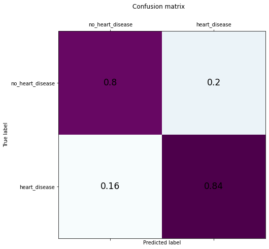

</div>

<div class="output stream stdout">

    The accuracy is: 82.7%
    The true positive rate is: 84.5%

</div>

</div>

<div class="cell code" data-execution_count="10" data-collapsed="false" data-pycharm="{&quot;name&quot;:&quot;#%%\n&quot;}">

``` python
lr_name = 'logistic_regression'
prediction = lr_clf.predict(X_test.astype(np.float32))
rounded_prediction = tf.math.round(prediction)
# create a confusion matrix
conf_matrix = confusion_matrix(y_true=y_test.astype(np.float32), y_pred=rounded_prediction)
tpr = visualize_confusion(conf_matrix, lr_name)

print('The accuracy is: ' +'{:.1%}'.format(lr_score))
print('The true positive rate is: ' +'{:.1%}'.format(tpr))
```

<div class="output display_data">

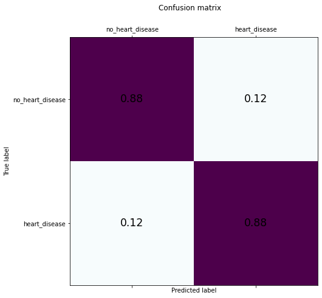

</div>

<div class="output stream stdout">

    The accuracy is: 87.8%
    The true positive rate is: 87.9%

</div>

</div>

<div class="cell markdown" data-collapsed="false" data-pycharm="{&quot;name&quot;:&quot;#%% md\n&quot;}">

Next step is to train a neural network. For this a sequential model with
25 input nodes, 13 hidden nodes, 1 dropout layer and 1 node output layer
with sigmoid activation function is created.

</div>

<div class="cell markdown" data-collapsed="false" data-pycharm="{&quot;name&quot;:&quot;#%% md\n&quot;}">

**Build the model**

</div>

<div class="cell code" data-execution_count="11" data-collapsed="false" data-pycharm="{&quot;name&quot;:&quot;#%%\n&quot;}">

``` python
model = tf.keras.models.Sequential([
        tf.keras.layers.Dense(13, activation='relu', input_dim=X_train.shape[1]),
        tf.keras.layers.Dropout(0.3),
        tf.keras.layers.Dense(1, activation='sigmoid')
    ])
```

</div>

<div class="cell markdown" data-collapsed="false" data-pycharm="{&quot;name&quot;:&quot;#%% md\n&quot;}">

To achieve good results the Adam optimizer and a binary crossentropy
loss function is chosen. For comparison the metrics 'accuracy' and
'recall' are used.

</div>

<div class="cell code" data-execution_count="12" data-collapsed="false" data-pycharm="{&quot;name&quot;:&quot;#%%\n&quot;}">

``` python
model.compile(optimizer='adam',
              loss='binary_crossentropy',
              metrics=[tf.keras.metrics.Recall(name='recall'), 'accuracy'])
```

</div>

<div class="cell markdown" data-collapsed="false" data-pycharm="{&quot;name&quot;:&quot;#%% md\n&quot;}">

To avoid overfitting an EarlyStopping callback is used. The monitoring
feature is the loss. The callback will stop the training if the loss
will not decrease within 50 iterations (*patience*). The weights of the
best run will be restored for the final model.

</div>

<div class="cell code" data-execution_count="13" data-collapsed="false" data-pycharm="{&quot;name&quot;:&quot;#%%\n&quot;}">

``` python
early_stopping_monitor = EarlyStopping(
    monitor='loss',
    min_delta=0,
    patience=50,
    verbose=0,
    mode='auto',
    baseline=None,
    restore_best_weights=True
)
```

</div>

<div class="cell markdown" data-collapsed="false" data-pycharm="{&quot;name&quot;:&quot;#%% md\n&quot;}">

**Train the model**

</div>

<div class="cell code" data-execution_count="14" data-collapsed="false" data-pycharm="{&quot;name&quot;:&quot;#%%\n&quot;}">

``` python
history = model.fit(X_train.astype(np.float32),
                    y_train.astype(np.float32),
                    callbacks=[early_stopping_monitor],
                    epochs=1000,
                    verbose=2)
```

<div class="output stream stdout">

    Epoch 1/1000
    7/7 - 0s - loss: 0.8237 - recall: 0.0392 - accuracy: 0.5000
    Epoch 2/1000
    7/7 - 0s - loss: 0.7507 - recall: 0.0588 - accuracy: 0.5051
    Epoch 3/1000
    7/7 - 0s - loss: 0.7178 - recall: 0.0980 - accuracy: 0.5000
    Epoch 4/1000
    7/7 - 0s - loss: 0.6897 - recall: 0.1471 - accuracy: 0.5354
    Epoch 5/1000
    7/7 - 0s - loss: 0.6884 - recall: 0.1667 - accuracy: 0.5152
    Epoch 6/1000
    7/7 - 0s - loss: 0.6671 - recall: 0.2157 - accuracy: 0.5152
    Epoch 7/1000
    7/7 - 0s - loss: 0.6611 - recall: 0.3235 - accuracy: 0.5808
    Epoch 8/1000
    7/7 - 0s - loss: 0.6280 - recall: 0.4608 - accuracy: 0.6414
    Epoch 9/1000
    7/7 - 0s - loss: 0.6151 - recall: 0.4706 - accuracy: 0.6818
    Epoch 10/1000
    7/7 - 0s - loss: 0.6062 - recall: 0.5686 - accuracy: 0.7020
    .
    .
    .
    7/7 - 0s - loss: 0.2594 - recall: 0.8922 - accuracy: 0.9091
    Epoch 380/1000
    7/7 - 0s - loss: 0.2605 - recall: 0.9118 - accuracy: 0.8990
    Epoch 381/1000
    7/7 - 0s - loss: 0.2763 - recall: 0.9118 - accuracy: 0.9141
    Epoch 382/1000
    7/7 - 0s - loss: 0.2415 - recall: 0.9118 - accuracy: 0.8939
    Epoch 383/1000
    7/7 - 0s - loss: 0.2898 - recall: 0.9118 - accuracy: 0.9040

</div>

</div>

<div class="cell markdown" data-collapsed="false" data-pycharm="{&quot;name&quot;:&quot;#%% md\n&quot;}">

**Evaluate the model**

</div>

<div class="cell code" data-execution_count="15" data-collapsed="false" data-pycharm="{&quot;name&quot;:&quot;#%%\n&quot;}">

``` python
eval_results = model.evaluate(X_test.astype(np.float32), y_test.astype(np.float32), verbose=2)

loss = history.history['loss']
rec = history.history['recall']
acc = history.history['accuracy']

epochs = range(1, len(loss) + 1)

fig_SI = plt.figure()

ax1_SI = fig_SI.add_subplot(111)

ax1_SI.plot(epochs, loss, 'g.', label='Training loss')
ax1_SI.plot(epochs, rec, 'b.', label='recall')
ax1_SI.plot(epochs, acc, 'r.', label='accuracy')

fig_SI.suptitle('Training loss and accuracy')
ax1_SI.set_xlabel('Epochs')
ax1_SI.legend()
fig_SI.show()
```

<div class="output stream stdout">

    4/4 - 0s - loss: 0.3053 - recall: 0.8966 - accuracy: 0.8776

</div>


<div class="output display_data">

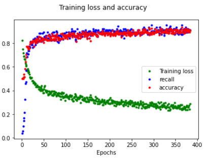

</div>

</div>

<div class="cell code" data-execution_count="16" data-collapsed="false" data-pycharm="{&quot;name&quot;:&quot;#%%\n&quot;}">

``` python
prediction = model.predict(X_test.astype(np.float32))
rounded_prediction = tf.math.round(prediction)
# create a confusion matrix
conf_matrix = confusion_matrix(y_true=y_test.astype(np.float32), y_pred=rounded_prediction)
keras_name = 'neural_net'
tpr = visualize_confusion(conf_matrix,keras_name)

print('The accuracy is: ' +'{:.1%}'.format(eval_results[2]))
print('The true positive rate is: ' +'{:.1%}'.format(tpr))
```

<div class="output display_data">


</div>

<div class="output stream stdout">

    The accuracy is: 87.8%
    The true positive rate is: 89.7%

</div>

</div>

<div class="cell markdown" data-collapsed="false" data-pycharm="{&quot;name&quot;:&quot;#%% md\n&quot;}">

The recall value is around 90%. That's great and shows the model
training was successful.

For later analysis it's interesting to know which datapoints were
incorrectly predicted. For this the incorrect predicted datapoint sets
are separated in "not predicted (pred = 0) as heart disease (y_true =1)"
(_heart__disease__predicion__wrong_) and "predicted (pred =1) as heart disease
(y_true = 0)"(_no__heart__disease__predicion_wrong). It is interesting to
analyse which features influenced the result in such a way that it
became wrong.

</div>

<div class="cell code" data-execution_count="36" data-collapsed="false" data-pycharm="{&quot;name&quot;:&quot;#%%\n&quot;}">

``` python
#find indices with wrong predcition
heart_disease_predicion_wrong = [] #y_true = 1; pred = 0
no_heart_disease_predicion_wrong = [] #y_true = 0; pred = 1

heart_disease_X_test = []
no_heart_disease_X_test = []

for i in range(len(X_test)):

    tmp_pred = rounded_prediction[i].numpy()
    prediction_for_test = int(tmp_pred)
    y_test_for_test = y_test.iloc[i]
    if 0 == y_test_for_test:
        if y_test_for_test != prediction_for_test:
            no_heart_disease_predicion_wrong.append(i)
        else:
            no_heart_disease_X_test.append(i)
    elif 1 == y_test_for_test:
        if y_test_for_test != prediction_for_test:
            heart_disease_predicion_wrong.append(i)
        else:
            heart_disease_X_test.append(i)

print(heart_disease_predicion_wrong)
print(no_heart_disease_predicion_wrong)
```

<div class="output stream stdout">

    [6, 10, 23, 75, 88, 89]
    [4, 17, 21, 42, 86, 96]

</div>

</div>

<div class="cell markdown" data-collapsed="false" data-pycharm="{&quot;name&quot;:&quot;#%% md\n&quot;}">

**Visualize the features with biggest impact on the output**

For visualization the [shap](https://github.com/slundberg/shap) package
is used.

</div>

<div class="cell code" data-execution_count="33" data-collapsed="false" data-pycharm="{&quot;name&quot;:&quot;#%%\n&quot;}">

``` python
shap.initjs()

col_names = list(X_train)
tmp = X_train.astype(np.float32)
X_train_flatten = tmp.to_numpy()

tmp_2 = X_test.astype(np.float32)
X_test_flatten = tmp_2.to_numpy()

e = shap.DeepExplainer(model, X_train_flatten)
shap_values = e.shap_values(X_test_flatten)
shap.summary_plot(shap_values, X_test_flatten, feature_names=col_names)
```

<div class="output display_data">

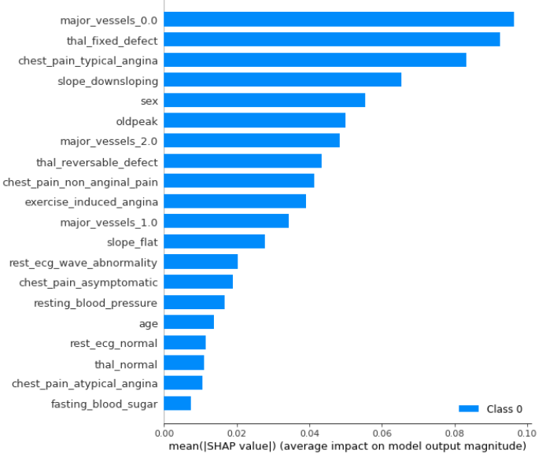

</div>

</div>

<div class="cell markdown" data-collapsed="false" data-pycharm="{&quot;name&quot;:&quot;#%% md\n&quot;}">

This chart shows the average impact of the dataset features on the model
output. It's visible that the feature _major__vessels_0.0 has the
biggest impact on the model output. The value 0 means that no major
vessels are visible on the flourosopy picture. It's a significant
feature of a heart disease. On the other hand a large number of major
vessels like the feature _major__vessels_3.0 is an indicator of a
low heart disease probability.

It's also visible that the feature chest pain (as typical angina and non
anginal pain) has an big impact on the output and also the sex.

The drawback of this kind of visualization is the missing information,
if the feature impacts the output positively or negatively.

</div>

<div class="cell markdown" data-collapsed="false" data-pycharm="{&quot;name&quot;:&quot;#%% md\n&quot;}">

#### Heart disease datapoints

To get a feeling which features have a positive or negative impact on
the output, a ***force plot*** is used. The next three plots are
datapoint set that are initially labeled as *heart disease* and were
correct predicted.

</div>

<div class="cell code" data-execution_count="40" data-collapsed="false" data-pycharm="{&quot;name&quot;:&quot;#%%\n&quot;}">

``` python
# get the average model output value
expected_value= tf.keras.backend.get_value(e.expected_value[0])
```

</div>

<div class="cell code" data-execution_count="78" data-collapsed="false" data-pycharm="{&quot;name&quot;:&quot;#%%\n&quot;}">

``` python
# save plots in the image folder
current_directory = os.getcwd()
image_folder_tmp = 'images'
image_folder = os.path.join(current_directory,image_folder_tmp)
```

</div>

<div class="cell code" data-execution_count="84" data-collapsed="false" data-pycharm="{&quot;name&quot;:&quot;#%%\n&quot;}">

``` python
index = heart_disease_X_test[0]
plot = shap.force_plot(expected_value, shap_values[0][index, :], X_test.iloc[index, :])

filename = 'heart_disease_' + str(index) + '.htm'
path_to_file = os.path.join(image_folder,filename)
shap.save_html(path_to_file,plot)

plot
```


<div class="output display_data">

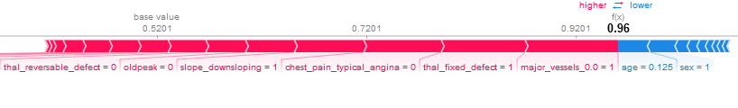

</div>

</div>

<div class="cell markdown" data-collapsed="false" data-pycharm="{&quot;name&quot;:&quot;#%% md\n&quot;}">

This datapoint set has a probability of 96% to be a *heart disease*
(true label is also heart disease). This **force plot** visualizes the
features that increase (red arrows) and decrease (blue arrows) the
probabilty value. Starting from the average model output value (base
value ~0.52) the features are summed up.

The result seems to be realistic. The presence of zero visible major
vessels (_major__vessels_0.0 = 1_) and a fixed defect thalassaemia
(_thal__fixed_defect = 1_) and the absence of normal chest pain
(_chest__pain__typical__angina = 0_) is very significant for a
heart disease. As visible in the above chart this three features have
the biggest impact on the output.

</div>

<div class="cell code" data-execution_count="85" data-collapsed="false" data-pycharm="{&quot;name&quot;:&quot;#%%\n&quot;}">

``` python
index = heart_disease_X_test[1]
plot = shap.force_plot(expected_value, shap_values[0][index, :], X_test.iloc[index, :])

filename = 'heart_disease_' + str(index) + '.htm'
path_to_file = os.path.join(image_folder,filename)
shap.save_html(path_to_file,plot)

plot
```

<div class="output display_data">

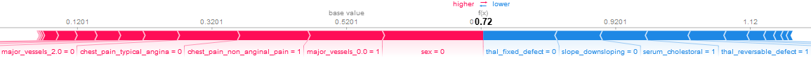

</div>

</div>

<div class="cell markdown" data-collapsed="false" data-pycharm="{&quot;name&quot;:&quot;#%% md\n&quot;}">

This datapoint set has a probability of 72% to be a *heart disease*
(true label is also heart disease).

The result also seems to be realistic. The presence of zero visible
major vessels (_major__vessels__0.0 = 1_) and of non anginal chest
pain (_chest__pain__non__anginal__pain = 1_) is very significant
for a heart disease. Additionally, the fact that the patient is a woman
(_sex = 0_) increases the heart disease probability.

Compared to the previous force plot the probability of 72% is lower than
96%. This is due to an absence of the "high impact" feature fixed defect
thalassaemia (_thal__fixed__defect = 0_) that decreases the output
value.

</div>

<div class="cell code" data-execution_count="86" data-collapsed="false" data-pycharm="{&quot;name&quot;:&quot;#%%\n&quot;}">

``` python
index = heart_disease_X_test[2]
plot = shap.force_plot(expected_value, shap_values[0][index, :], X_test.iloc[index, :])

filename = 'heart_disease_' + str(index) + '.htm'
path_to_file = os.path.join(image_folder,filename)
shap.save_html(path_to_file,plot)

plot
```

<div class="output display_data">

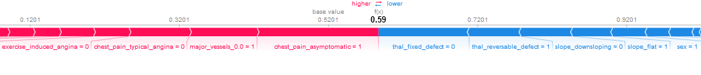

</div>

</div>

<div class="cell markdown" data-collapsed="false">

This datapoint set has a probability of 59% to be a *heart disease*
(true label is also heart disease).

The result also seems to be realistic because "high impact" features are
in balance and it seems really not to be clear if it is a heart disease
or not. This is reflected in a probability of 59%. On the one hand the
presence of zero visible major vessels (_major__vessels_0.0 = 1_)
and an ansymptomatic chest pain (_chest__pain__asymptomatic = 1_)
and on the other hand the absence of a fixed defect thalassaemia
(_thal__fixed__defect = 0_) but a presence of a reversable defect
thalassaemia (_thal__reversable__defect = 1_) balance each other
out.

</div>

<div class="cell markdown" data-collapsed="false" data-pycharm="{&quot;name&quot;:&quot;#%% md\n&quot;}">

#### No heart disease datapoints

Now it's interesting to analyze which features are most important for
datapoint set that where initially labeled as *no heart disease* and
were correct predicted.

</div>

<div class="cell code" data-execution_count="87" data-collapsed="false" data-pycharm="{&quot;name&quot;:&quot;#%%\n&quot;}">

``` python
index = no_heart_disease_X_test[0]
plot = shap.force_plot(expected_value, shap_values[0][index, :], X_test.iloc[index, :])

filename = 'no_heart_disease_' + str(index) + '.htm'
path_to_file = os.path.join(image_folder,filename)
shap.save_html(path_to_file,plot)

plot
```

<div class="output display_data">

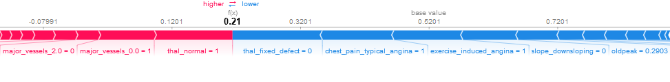

</div>

</div>

<div class="cell markdown" data-collapsed="false">

This datapoint set has a probability of 21% to be a *heart disease*
(true label is also no heart disease).

The result also seems to be realistic. There is a presence of zero
visible major vessels (_major__vessels__0.0 = 1_), but also a
presence of normal thalassaemia (_thal__normal = 1_) and a absence
of a fixed thalassaemia defect (_thal__fixed__defect = 0_).
Additionally, it is a typical angina chest pain
(_chest__pain__typical__angina = 1_) and the angina was induced
by exercise (_exercise__induced__angina = 1_). The patient seems to
have a problem but not a heart disease.

</div>

<div class="cell code" data-execution_count="88" data-collapsed="false" data-pycharm="{&quot;name&quot;:&quot;#%%\n&quot;}">

``` python
index = no_heart_disease_X_test[1]
plot = shap.force_plot(expected_value, shap_values[0][index, :], X_test.iloc[index, :])

filename = 'no_heart_disease_' + str(index) + '.htm'
path_to_file = os.path.join(image_folder,filename)
shap.save_html(path_to_file,plot)

plot
```

<div class="output display_data">

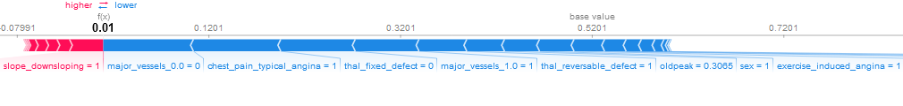

</div>

</div>

<div class="cell markdown" data-collapsed="false">

This datapoint set has a probability of 1% to be a *heart disease* (true
label is also no heart disease).

The result also seems to be realistic and significant. There is a
presence of one visible major vessels (_major__vessels__1.0 = 1_), a
reversable thalassaemia defect (_thal__reversable__defect = 1_) and
the angina was induced by exercise (_exercise__induced__angina =
1_). The patient seems to have a problem but not a heart disease.

</div>

<div class="cell code" data-execution_count="89" data-collapsed="false" data-pycharm="{&quot;name&quot;:&quot;#%%\n&quot;}">

``` python
index = no_heart_disease_X_test[2]
plot = shap.force_plot(expected_value, shap_values[0][index, :], X_test.iloc[index, :])

filename = 'no_heart_disease_' + str(index) + '.htm'
path_to_file = os.path.join(image_folder,filename)
shap.save_html(path_to_file,plot)

plot
```

<div class="output display_data">

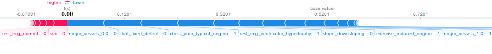

</div>

</div>

<div class="cell markdown" data-collapsed="false">

This datapoint set has a probability of 0% to be a *heart disease* (true
label is also no heart disease).

The result also seems to be realistic and significant. There is a
presence of one visible major vessels (_major__vessels__1.0 = 1_), a
typical angina chest pain (_chest__pain__typical__angina = 1_)
and the angina was induced by exercise (_exercise__induced__angina =
1_). The patient seems to have a problem but not a heart disease.

</div>

<div class="cell markdown" data-collapsed="false" data-pycharm="{&quot;name&quot;:&quot;#%% md\n&quot;}">

#### Heart disease datapoints incorrectly predicted as no heart disease

The next three datapoint sets are initially labeled as _heart disease_
but they are predicted to be _no heart disease_

</div>

<div class="cell code" data-execution_count="90" data-collapsed="false" data-pycharm="{&quot;name&quot;:&quot;#%%&quot;}">

``` python
# predicted to be not a heart disease but true label is 1
index = heart_disease_predicion_wrong[0] #y_true = 1; pred = 0[2]
plot = shap.force_plot(expected_value, shap_values[0][index, :], X_test.iloc[index, :])

filename = 'heart_disease_prediction_wrong_' + str(index) + '.htm'
path_to_file = os.path.join(image_folder,filename)
shap.save_html(path_to_file,plot)

plot
```

<div class="output display_data">

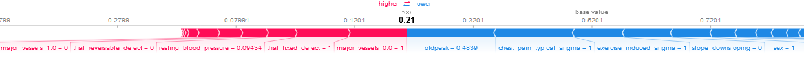

</div>

</div>

<div class="cell code" data-execution_count="91" data-collapsed="false" data-pycharm="{&quot;name&quot;:&quot;#%%\n&quot;}">

``` python
# predicted to be not a heart disease but true label is 1
index = heart_disease_predicion_wrong[1] #y_true = 1; pred = 0[2]
plot = shap.force_plot(expected_value, shap_values[0][index, :], X_test.iloc[index, :])

filename = 'heart_disease_prediction_wrong_' + str(index) + '.htm'
path_to_file = os.path.join(image_folder,filename)
shap.save_html(path_to_file,plot)

plot
```

<div class="output display_data">

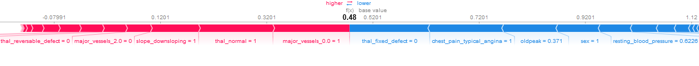

</div>

</div>

<div class="cell code" data-execution_count="92" data-collapsed="false" data-pycharm="{&quot;name&quot;:&quot;#%%\n&quot;}">

``` python
# predicted to be not a heart disease but true label is 1
index = heart_disease_predicion_wrong[2] #y_true = 1; pred = 0[2]
plot = shap.force_plot(expected_value, shap_values[0][index, :], X_test.iloc[index, :])

filename = 'heart_disease_prediction_wrong_' + str(index) + '.htm'
path_to_file = os.path.join(image_folder,filename)
shap.save_html(path_to_file,plot)

plot
```

<div class="output display_data">

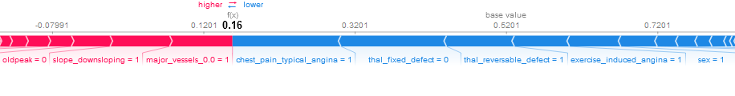

</div>

</div>

<div class="cell markdown" data-collapsed="false" data-pycharm="{&quot;name&quot;:&quot;#%% md\n&quot;}">

Checking out the three plots shows the probabilities of 21%, 48% and
16%. On one side the datapoint set with 48% is in the middle and could
be both a _heart disease_ and _no heart disease_ on the other side 21%
and 16% are very significant.

An analysis of the three plots shows a presence of zero visible major
vessels (_major__vessels__0.0 = 1_). This is the most significant
feature for a heart disease. Additionally, all three patients had a
typical angina chest pain (_chest__pain__typical__angina = 1_)
and in two cases the angina was induced by exercise
(_exercise__induced__angina = 1_). Both features were also present
in the _no heart disease_ datapoint sets. It is also noticeable that in
this "wrong prediction cases" the feature _oldpeak_ is present.

</div>

<div class="cell markdown" data-collapsed="false" data-pycharm="{&quot;name&quot;:&quot;#%% md\n&quot;}">

#### No Heart disease datapoints incorrectly predicted as heart disease

The next step is to analyse datapoint sets that are initially labeled as
*no heart disease* but they are predicted to be *heart disease*.

</div>

<div class="cell code" data-execution_count="93" data-collapsed="false" data-pycharm="{&quot;name&quot;:&quot;#%%\n&quot;}">

``` python
# predicted to be a heart disease but true label is 0
index = no_heart_disease_predicion_wrong[0]
plot = shap.force_plot(expected_value, shap_values[0][index, :], X_test.iloc[index, :])

filename = 'no_heart_disease_prediction_wrong_' + str(index) + '.htm'
path_to_file = os.path.join(image_folder,filename)
shap.save_html(path_to_file,plot)

plot
```

<div class="output display_data">

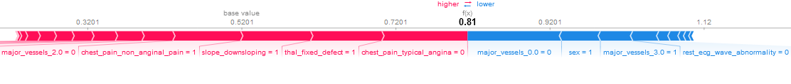

</div>

</div>

<div class="cell code" data-execution_count="94" data-collapsed="false" data-pycharm="{&quot;name&quot;:&quot;#%%\n&quot;}">

``` python
# predicted to be a heart disease but true label is 0
index = no_heart_disease_predicion_wrong[1]
plot = shap.force_plot(expected_value, shap_values[0][index, :], X_test.iloc[index, :])

filename = 'no_heart_disease_prediction_wrong_' + str(index) + '.htm'
path_to_file = os.path.join(image_folder,filename)
shap.save_html(path_to_file,plot)

plot
```

<div class="output display_data">

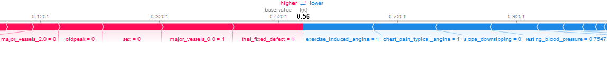

</div>

</div>

<div class="cell code" data-execution_count="95" data-collapsed="false" data-pycharm="{&quot;name&quot;:&quot;#%%\n&quot;}">

``` python
# predicted to be a heart disease but true label is 0
index = no_heart_disease_predicion_wrong[2]
plot = shap.force_plot(expected_value, shap_values[0][index, :], X_test.iloc[index, :])

filename = 'no_heart_disease_prediction_wrong_' + str(index) + '.htm'
path_to_file = os.path.join(image_folder,filename)
shap.save_html(path_to_file,plot)

plot
```

<div class="output display_data">

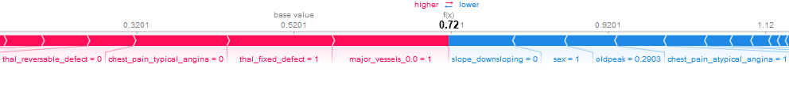

</div>

</div>

<div class="cell markdown" data-collapsed="false" data-pycharm="{&quot;name&quot;:&quot;#%% md\n&quot;}">

Checking out the three plots shows the probabilities of 81%, 56% and
72%. On one side the datapoint set with 56% is in the middle and could
be both a *heart disease* and *no heart disease* on the other side 81%
and 72% are very significant.

An analysis of the three plots shows a presence of a fixed defect
thalassaemia (_thal__fixed__defect = 0_) and in two of three cases
zero visible major vessels (_major__vessels__0.0 = 1_). This are
very significant feature for a heart disease. Additionally, in two cases
the chest pain is not a typical angina
(_chest__pain__typical__angina = 0_), normally a typical angina
is a significant feature of no heart disease.

</div>

<div class="cell markdown" data-collapsed="false" data-pycharm="{&quot;name&quot;:&quot;#%% md\n&quot;}">

### Conclusion

The model has an accuracy of 87.8% and a true positive rate of 89.7%.
These values a very good and show that a heart disease is predictable in
9 of 10 cases. Checking out the feature importance within the neural net
give a good feeling which features are relevant and have a big impact on
the model output. Analysing correct predicted *heart disease* and *no
heart disease* cases show in which manner the presence or absence of a
feature impact the output. With this knowledge it is explainable why
incorrectly predicted datapoint set were interpreted this way.

</div>
